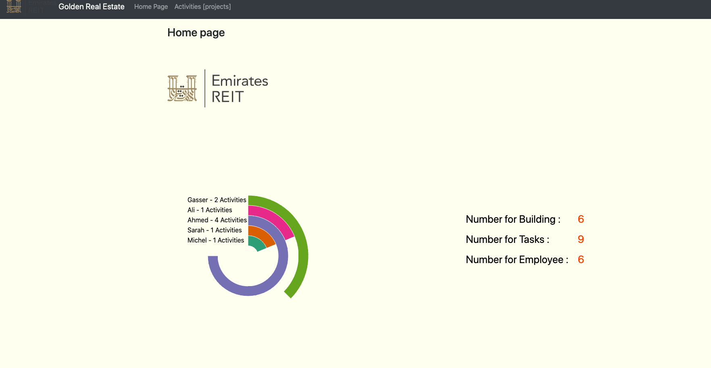
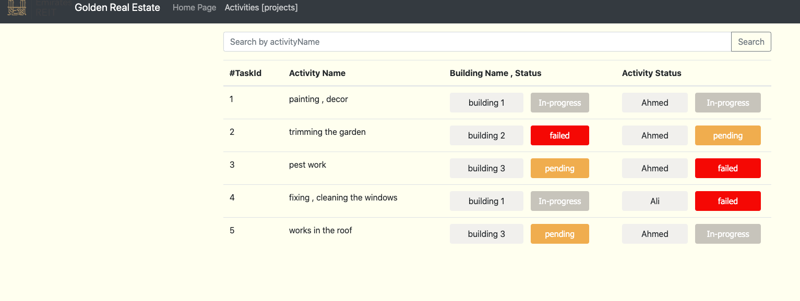

* **welcome to the Task List app** 

Here's the documentation of the app 

* **Application Description**
- This app responsible for monitoring the development process of the buildings for Golden Real Estate Company 
depending on the status for every activity per the person (employee)

* **Assumptions :** No assumptions , just using flyway to init dummy data into db
  

*  **Application features** 

- Able to monitor the progress of the company activities per building
- Able to monitor the progress of the building
- Status entity for ading more status in the future with colors for better user interface
- Good  UI/ UX design 
- d3.js charts for monitor the activity per user 
- Search bar to search by name in the projects grid view
  

*  **Tech stack** 
   
   1- Java Spring Boot for BE 
   2- VueJs for FE
   3- d3 for charts visualisation
   4- postgres for db 
   5- docker to create postgres container
   6- swagger for docs 

*  **How to run the app** 

if you are using IDE or terminal  

As long as am using spring boot as BE so it has jetty embedded server , and configured ,

you will notice
  
`2021-02-06 18:45:03.374  INFO 33843 --- [           main] o.s.b.web.embedded.jetty.JettyWebServer  : Jetty started on port(s) 5500 (http/1.1) with context path '/'
`
  
in console once you run using this CMD : `mvn spring-boot:run`   on jetty embedded  server
  
After running the app ,  for BE , you wil find all endpoints with docs here in swagger

`http://localhost:5500/swagger-ui/index.html?configUrl=/v3/api-docs/swagger-config#`

 

**_Bonus_**

- Using d3 library for visualization with charts in home page for activities per an employee that assigned to + some analytics and number refer to the progress.

* **Use Docker**
  
- Using docker-compose file **Recommended in development**
  
- just run `docker-compose build` 
- then `docker-compose up`
- then the project exposed to 5500 port 
- then hit `http://localhost:5500/#/home`
  

- U can also run (Docker Native) For DB (postgres) : 

`docker run --name postgresql -p 5432:5432  -e POSTGRESQL_USERNAME=Sylvain -e ALLOW_EMPTY_PASSWORD=yes  -e POSTGRESQL_DATABASE=test  bitnami/postgresql:latest`
 
  then create `tests`  db manually 
  

 **Image from the product :**  

